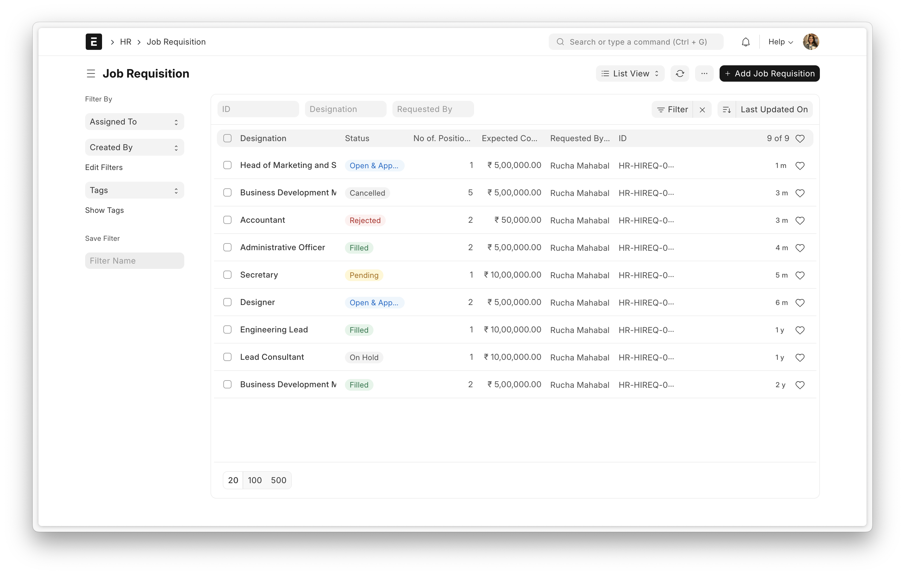

<div align="center">
    <a href="https://frappe.io/hr">
        
    </a>
    <h2>Frappe HR</h2>
    <p align="center">
        <p>开源、现代化且易用的人力资源与薪资管理软件</p>
    </p>

[](https://github.com/frappe/hrms/actions/workflows/ci.yml)
[](https://codecov.io/gh/frappe/hrms)

<a href="https://trendshift.io/repositories/10972" target="_blank"></a>
</div>

<div align="center">
    
</div>

<div align="center">
    <a href="https://frappe.io/hr">官方网站</a>
    -
    <a href="https://docs.frappe.io/hr/introduction">文档</a>
</div>

## Frappe HR

Frappe HR 提供企业卓越管理所需的全套解决方案。作为完整的人力资源管理系统（HRMS），它涵盖从员工管理、入职管理、休假管理到薪资与税务管理等13余个核心模块。

## 开发背景​
随着Frappe团队规模持续扩大，当时我们亟需一款开源的人力资源与薪资管理软件。然而市场上并未找到真正符合开源精神的产品，因此决定自主构建。
最初它以ERPNext功能模块集合的形式存在；直到第14版，随着各模块逐步成熟，Frappe HR正式作为独立产品发布。
## 核心功能

- **员工全周期管理**：从员工入职、晋升、调动，到记录反馈和离职面谈，全方位简化员工在企业的完整职业周期管理流程。
- **请假与考勤**：配置请假政策，一键获取地区节假日，支持地理位置打卡，报表跟踪请假余额和考勤情况。
- **费用报销与预支**：管理员工预支、报销费用，配置多级审批流程，并与 ERPNext 会计无缝集成。
- **绩效管理**：跟踪目标，将目标与关键结果领域（KRA）对齐，支持员工自评，简化绩效考核流程。
- **薪资与税务**：创建薪资结构，配置所得税等级，运行标准薪资流程，支持额外薪资和非周期性支付，薪资单可查看收入明细等更多功能。
- **Frappe HR 移动应用**：随时随地申请和审批请假，打卡，访问员工资料。

<details open>

<summary>查看截图</summary>
    
    
    
    
    
</details>

### 技术架构

- [**Frappe 框架**](https://github.com/frappe/frappe)：一个用 Python 和 Javascript 编写的全栈 Web 应用框架。该框架为构建 Web 应用提供了坚实基础，包括数据库抽象层、用户认证和 REST API。

- [**Frappe UI**](https://github.com/frappe/frappe-ui)：基于 Vue 的 UI 库，提供现代化用户界面。Frappe UI 库包含多种组件，可用于在 Frappe 框架之上构建单页应用。

## 生产环境部署

### 云托管服务

您可选用 [Frappe Cloud](https://frappecloud.com)，这是一个简单、易用且功能强大的[开源](https://github.com/frappe/press)平台，为您的Frappe应用提供无忧托管服务。

它负责安装、设置、升级、监控、维护和支持你的 Frappe 部署。它是一个功能齐全的开发者平台，能够管理和控制多个 Frappe 部署。

<div>
    <a href="https://frappecloud.com/hrms/signup" target="_blank">
        <picture>
            <source media="(prefers-color-scheme: dark)" srcset="https://frappe.io/files/try-on-fc-white.png">
            
        </picture>
    </a>
</div>


## 开发环境配置
### Docker
您需要在机器上安装 Docker、docker-compose 和 git。参考 [Docker 文档](https://docs.docker.com/)。之后运行以下命令：
```
git clone https://github.com/frappe/hrms
cd hrms/docker
docker-compose up
```

等待一段时间，直到安装脚本创建好站点。之后您可以在浏览器访问 `http://localhost:8000`，此时将显示HR 登录界面。

使用以下凭证登录：

- 用户名：`Administrator`
- 密码：`admin`

### 本地部署

1. 按照[安装步骤](https://frappeframework.com/docs/user/en/installation)设置 bench 并启动服务器并保持运行
    ```sh
    $ bench start
    ```
2. 在另一个终端窗口运行以下命令
    ```sh
    $ bench new-site hrms.local
    $ bench get-app erpnext
    $ bench get-app hrms
    $ bench --site hrms.local install-app hrms
    $ bench --site hrms.local add-to-hosts
    ```
3. 您可通过 `http://hrms.local:8080` 访问该站点

## 学习与社区

1. [Frappe School](https://frappe.school) - 由维护者或社区成员提供的 Frappe 框架和 ERPNext 各类课程。
2. [文档](https://docs.frappe.io/hr) - Frappe HR 的详细文档。
3. [用户论坛](https://discuss.erpnext.com/) - 与 ERPNext 用户和服务商社区互动。
4. [Telegram 群组](https://t.me/frappehr) - 从用户社区获得即时帮助。


## 贡献

1. [问题提交指南](https://github.com/frappe/erpnext/wiki/Issue-Guidelines)
2. [安全漏洞报告](https://erpnext.com/security)
3. [拉取请求要求](https://github.com/frappe/erpnext/wiki/Contribution-Guidelines)


## Logo 和商标政策

请阅读我们的 [Logo 和商标政策](TRADEMARK_POLICY.md)。

<br />
<br />
<div align="center" style="padding-top: 0.75rem;">
    <a href="https://frappe.io" target="_blank">
        <picture>
            <source media="(prefers-color-scheme: dark)" srcset="https://frappe.io/files/Frappe-white.png">
            
        </picture>